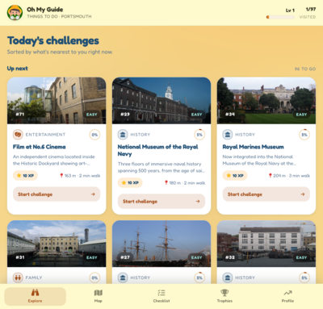
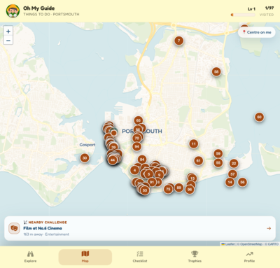
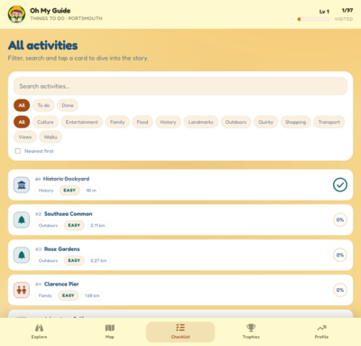
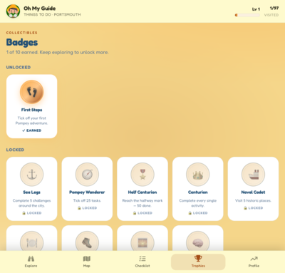
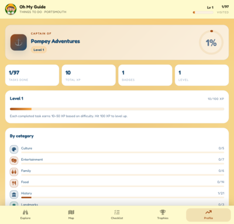

# Oh My Guide

Oh My Guide is an activity discovery website with just shy of 100 _quests_ to fulfil in and around Portsmouth.

Made by [Rieona](https://github.com/rieo-waffle) with a little help from [Tom](https://github.com/CalmArms)

You can play with it now at [omg.thomashewett.com](https://omg.thomashewett.com)

  
  
  
  
  

## What you can do

- **Discover Portsmouth** — 97 places to visit across the city, from harbour walks and historic ships to family parks, cafés, and quirky hidden corners.
- **Check in when you arrive** — your phone knows when you've made it to a place and then you can tick the box to complete the quest.
- **Level up as you explore** — every place you visit earns you points and gives you xp which in turn levels you up. Trickier spots are worth more.
- **Five sections**:
    - **Explore** — see what's nearby and get fresh suggestions.
    - **Map** — see every place on a map of Portsmouth.
    - **Checklist** — a tidy list to tick off, sorted by the kind of thing it is.
    - **Achievements** — unlock badges as you finish off categories or hit milestones.
    - **Profile** — a quick look at how far you've come.
- **Surprise badges** — finish a set of places and a little reward pops up to celebrate.
- **See how far you've got** — every category shows a progress ring, so you know if you're nearly there.
